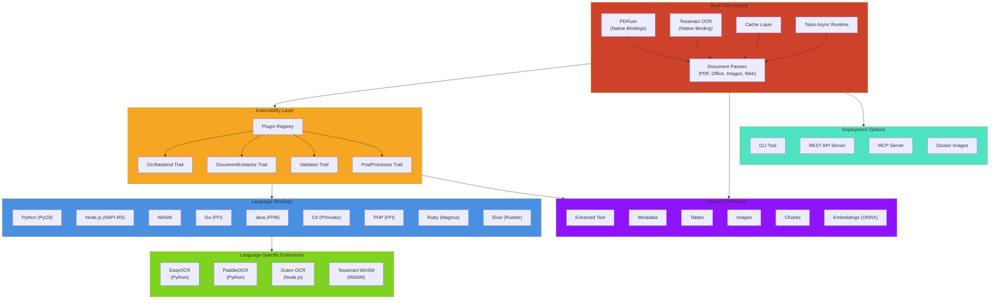

# Kreuzberg.dev

  <!-- Language Bindings -->
  
  
  
  
  

  
  
  
  
  

  <!-- Project Info -->
  
  

  

Extract text and metadata from a wide range of file formats (56+), generate embeddings and post-process at native speeds without needing a GPU.

> Note - Kreuzberg v4.0.0 is in **Release Candidate** stage. Bugs and breaking changes are expected.
> This is a pre-release version. Please test the library and [report any issues](https://github.com/kreuzberg-dev/kreuzberg/issues) you encounter.

## Key Features

- **Extensible architecture** – Plugin system for custom OCR backends, validators, post-processors, and document extractors
- **Polyglot** – Native bindings for Rust, Python, TypeScript/Node.js, Ruby, Go, Java, C#, PHP, and Elixir
- **56 file formats** – PDF, Office documents, images, HTML, XML, emails, archives, academic formats across 8 categories
- **OCR support** – Tesseract (all languages via native binding), EasyOCR/PaddleOCR (Python), Guten (Node.js), extensible via plugin API
- **High performance** – Rust core with native PDFium, SIMD optimizations and full parallelism
- **Flexible deployment** – Use as library, CLI tool, REST API server, or MCP server
- **Memory efficient** – Streaming parsers for multi-GB files

**[Complete Documentation](https://kreuzberg.dev/)** | **[Installation Guides](#installation)**

## Installation

Each language binding provides comprehensive documentation with examples and best practices. Choose your platform to get started:

**Scripting Languages:**
- **[Python](https://github.com/kreuzberg-dev/kreuzberg/tree/main/packages/python)** – PyPI package, async/sync APIs, OCR backends (Tesseract, EasyOCR, PaddleOCR)
- **[Ruby](https://github.com/kreuzberg-dev/kreuzberg/tree/main/packages/ruby)** – RubyGems package, idiomatic Ruby API, native bindings
- **[PHP](https://github.com/kreuzberg-dev/kreuzberg/tree/main/packages/php)** – Composer package, modern PHP 8.2+ support, type-safe API
- **[Elixir](https://github.com/kreuzberg-dev/kreuzberg/tree/main/packages/elixir)** – Hex package, OTP integration, concurrent processing

**JavaScript/TypeScript:**
- **[@kreuzberg/node](https://github.com/kreuzberg-dev/kreuzberg/tree/main/crates/kreuzberg-node)** – Native NAPI-RS bindings for Node.js/Bun, fastest performance
- **[@kreuzberg/wasm](https://github.com/kreuzberg-dev/kreuzberg/tree/main/packages/typescript)** – WebAssembly for browsers/Deno/Cloudflare Workers

**Compiled Languages:**
- **[Go](https://github.com/kreuzberg-dev/kreuzberg/tree/main/packages/go)** – Go module with FFI bindings, context-aware async
- **[Java](https://github.com/kreuzberg-dev/kreuzberg/tree/main/packages/java)** – Maven Central, Foreign Function & Memory API
- **[C#](https://github.com/kreuzberg-dev/kreuzberg/tree/main/packages/csharp)** – NuGet package, .NET 6.0+, full async/await support

**Native:**
- **[Rust](https://github.com/kreuzberg-dev/kreuzberg/tree/main/crates/kreuzberg)** – Core library, flexible feature flags, zero-copy APIs

**Command-Line:**
- **[CLI](https://kreuzberg.dev/cli/usage/)** – Cross-platform binary, batch processing, MCP server mode

### Embeddings Support (Optional)

To use embeddings functionality:

1. **Install ONNX Runtime 1.21 or lower**:
   - Linux: `apt install libonnxruntime` (ensure version ≤ 1.21) or download from [ONNX Runtime releases](https://github.com/microsoft/onnxruntime/releases)
   - macOS: `brew install onnxruntime@1.21`
   - Windows: Download version 1.21 or lower from [ONNX Runtime releases](https://github.com/microsoft/onnxruntime/releases)

2. Use embeddings in your code - see [Embeddings Guide](https://kreuzberg.dev/features/#embeddings)

**Note:** Kreuzberg requires ONNX Runtime version 1.21 or lower for embeddings. Newer versions may not be compatible. All other Kreuzberg features work without ONNX Runtime.

## Supported Formats

56 file formats across 8 major categories with intelligent format detection and comprehensive metadata extraction.

### Office Documents

| Category | Formats | Capabilities |
|----------|---------|--------------|
| **Word Processing** | `.docx`, `.odt` | Full text, tables, images, metadata, styles |
| **Spreadsheets** | `.xlsx`, `.xlsm`, `.xlsb`, `.xls`, `.xla`, `.xlam`, `.xltm`, `.ods` | Sheet data, formulas, cell metadata, charts |
| **Presentations** | `.pptx`, `.ppt`, `.ppsx` | Slides, speaker notes, images, metadata |
| **PDF** | `.pdf` | Text, tables, images, metadata, OCR support |
| **eBooks** | `.epub`, `.fb2` | Chapters, metadata, embedded resources |

### Images (OCR-Enabled)

**Raster:** `.png`, `.jpg`, `.jpeg`, `.gif`, `.webp`, `.bmp`, `.tiff`, `.tif`
**Advanced:** `.jp2`, `.jpx`, `.jpm`, `.mj2`, `.pnm`, `.pbm`, `.pgm`, `.ppm`
**Vector:** `.svg`

All image formats support OCR with table detection and metadata extraction (EXIF, dimensions, color space).

### Web & Data

| Category | Formats | Features |
|----------|---------|----------|
| **Markup** | `.html`, `.htm`, `.xhtml`, `.xml`, `.svg` | DOM parsing, metadata (Open Graph, Twitter Card), link extraction |
| **Structured Data** | `.json`, `.yaml`, `.yml`, `.toml`, `.csv`, `.tsv` | Schema detection, nested structures, validation |
| **Text & Markdown** | `.txt`, `.md`, `.markdown`, `.rst`, `.org`, `.rtf` | CommonMark, GFM, reStructuredText, Org Mode |

### Email & Archives

| Category | Formats | Features |
|----------|---------|----------|
| **Email** | `.eml`, `.msg` | Headers, body (HTML/plain), attachments, threading |
| **Archives** | `.zip`, `.tar`, `.tgz`, `.gz`, `.7z` | File listing, nested archives, metadata |

### Academic & Scientific

| Category | Formats | Features |
|----------|---------|----------|
| **Citations** | `.bib`, `.biblatex`, `.ris`, `.enw`, `.csl` | Bibliography parsing, citation extraction |
| **Scientific** | `.tex`, `.latex`, `.typst`, `.jats`, `.ipynb`, `.docbook` | LaTeX, Jupyter notebooks, PubMed JATS |
| **Documentation** | `.opml`, `.pod`, `.mdoc`, `.troff` | Technical documentation formats |

**[Complete Format Reference →](https://kreuzberg.dev/reference/formats/)**

## Key Features

### OCR with Table Extraction

Multiple OCR backends (Tesseract, EasyOCR, PaddleOCR) with intelligent table detection and reconstruction. Extract structured data from scanned documents and images with configurable accuracy thresholds.

**[OCR Backend Documentation →](https://kreuzberg.dev/guides/ocr/)**

### Batch Processing

Process multiple documents concurrently with configurable parallelism. Optimize throughput for large-scale document processing workloads with automatic resource management.

**[Batch Processing Guide →](https://kreuzberg.dev/features/#batch-processing)**

### Password-Protected PDFs

Handle encrypted PDFs with single or multiple password attempts. Supports both RC4 and AES encryption with automatic fallback strategies.

**[PDF Configuration →](https://kreuzberg.dev/migration/v3-to-v4/#password-protected-pdfs)**

### Language Detection

Automatic language detection in extracted text using fast-langdetect. Configure confidence thresholds and access per-language statistics.

**[Language Detection Guide →](https://kreuzberg.dev/features/#language-detection)**

### Metadata Extraction

Extract comprehensive metadata from all supported formats: authors, titles, creation dates, page counts, EXIF data, and format-specific properties.

**[Metadata Guide →](https://kreuzberg.dev/reference/types/#metadata)**

## Deployment Options

### REST API Server

Production-ready API server with OpenAPI documentation, health checks, and telemetry support. Deploy standalone or in containers with automatic format detection and streaming support.

**[API Server Documentation →](https://kreuzberg.dev/guides/api-server/)**

### MCP Server (AI Integration)

Model Context Protocol server for AI assistants. Enables AI agents to extract and process documents directly with full configuration support.

**[MCP Server Documentation →](https://kreuzberg.dev/guides/api-server/#mcp-server_1)**

### Docker

Official Docker images available in multiple variants:

- **Core** (~1.0-1.3GB): Full featured core, including API, CLI, MCP and Embedding with ONNX runtime
- **Full** (~1.5-2.1GB): Adds LibreOffice for legacy Office formats (.doc, .ppt)

All images support API server, CLI, and MCP server modes with automatic platform detection for linux/amd64 and linux/arm64.

**[Docker Deployment Guide →](https://kreuzberg.dev/guides/docker/)**

## Comparison with Alternatives

| Feature | Kreuzberg | docling | unstructured | LlamaParse |
|---------|-----------|---------|--------------|------------|
| **Formats** | 56 | PDF, DOCX | 30+ | PDF only |
| **Self-hosted** | ✅ Yes (MIT) | ✅ Yes | ✅ Yes | ❌ API only |
| **Programming Languages** | Rust, Python, Ruby, TS, Java, Go, C# | Python | Python | API (any) |
| **Table Extraction** | ✅ Good | ✅ Good | ✅ Basic | ✅ Excellent |
| **OCR** | ✅ Multiple backends | ✅ Yes | ✅ Yes | ✅ Yes |
| **Embeddings** | ✅ Built-in | ❌ No | ❌ No | ❌ No |
| **Chunking** | ✅ Built-in | ❌ No | ✅ Yes | ❌ No |
| **Cost** | Free (MIT) | Free (MIT) | Free (Apache 2.0) | $0.003/page |
| **Air-gap deployments** | ✅ Yes | ✅ Yes | ✅ Yes | ❌ No |

## Architecture

Kreuzberg is built as an extensible document intelligence engine with a Rust core, plugin system, and polyglot bindings.

<strong>System Architecture Diagram</strong>

### Design Principles

- **Rust core with native PDFium** – PDFium integrated via native bindings, bundled by default
- **Extensible architecture** – Plugin system for custom OCR backends, validators, post-processors, and extractors
- **High performance** – Global Tokio runtime, SIMD optimizations, zero-copy operations, streaming parsers
- **Memory efficient** – Streaming parsers for multi-GB files, lazy initialization
- **Polyglot bindings** – Native bindings for 9 languages, language-specific extensions supported

## Documentation

- **[Installation Guide](https://kreuzberg.dev/getting-started/installation/)** – Setup and dependencies
- **[User Guide](https://kreuzberg.dev/guides/extraction/)** – Comprehensive usage guide
- **[API Reference](https://kreuzberg.dev/reference/api-python/)** – Complete API documentation
- **[Format Support](https://kreuzberg.dev/reference/formats/)** – Supported file formats
- **[OCR Backends](https://kreuzberg.dev/guides/ocr/)** – OCR engine setup
- **[CLI Guide](https://kreuzberg.dev/cli/usage/)** – Command-line usage
- **[Migration Guide](https://kreuzberg.dev/migration/v3-to-v4/)** – Upgrading from v3

## Contributing

Contributions are welcome! See [CONTRIBUTING.md](CONTRIBUTING.md) for guidelines.

## License

MIT License - see [LICENSE](LICENSE) for details. You can use Kreuzberg freely in both commercial and closed-source products with no obligations, no viral effects, and no licensing restrictions.
